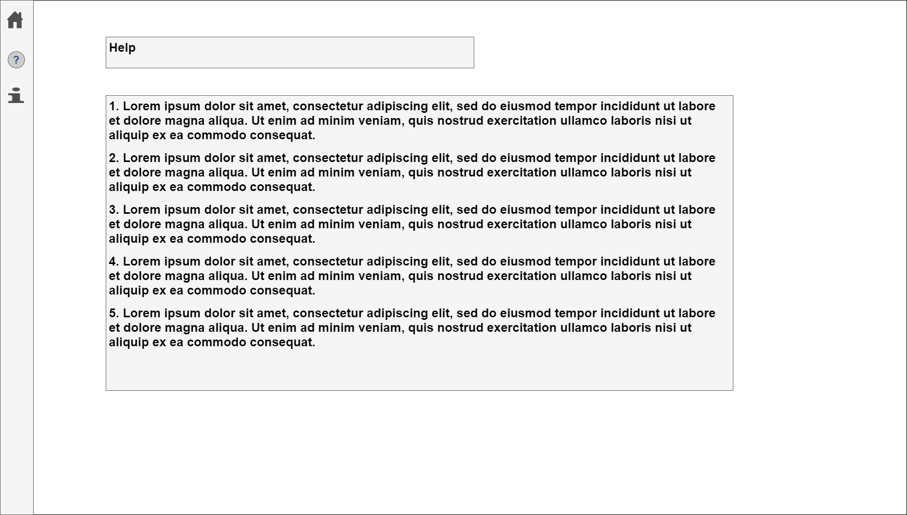

# **Individual Report**
Student Name: Olena Spektor

Student ID: 10003472
***
 

The first meeting was organised on the 4th of September by the team leader, Johnny Kingi. Following the marking guide of the assessment, we discussed what resources we are going to use, a possible outlook of the application, the tools we are planning to use during the development. As all the other team members, I also suggested a couple of ideas during the meeting. Some of them were agreed to be used during the development of the application as well as the others are still under the consideration and required some discussion. 
  All my ideas and suggestions are described below.

## Team Roles Allocation
During the second meeting (6/9/2017) the team delegate the tasks to the team members. I was given a "designer" position which I am very happy with as I'm planning to focus on the design and front-end development in the future. 

Later on, on the Slack channel, I suggested to break down the app development into the smaller sections, where each of the section will be a block of completed code. I think it is necessary because in this way we reduce chances of creating lots of different bugs. Also, it will help to manage app development, especially to debug and identify the location of a bug in the code at different stages of the app development as well as to identify who of the team members was responsible for that particular block of code with mistakes.  

The suggestions are still under consideration by the team at the moment. Here is a copy of them:
1. Initial setup (here someone creates all the basic documents for the development - main.js, package.json, index.html and so on (some of them can be plain like style.css) + organize the folders for the code of the app)
2. Title, input fields, submit button ( those sections are small and can be done by one person)
3. Map and weather sections ( I think it needs to be done after #2 as we can't test whether it's working properly if input section is empty)
4. More details pop-up screen development
5. Navigation bar (as the main functionality is done by this stage and we can start to organize the app)
6. Help page
7. Resources page
8. Design of the app (it needs to be fixed and it needs to be finished before applying css)
9. Final styling of the app in the css file
10. As an option, we can do a research and see whether we can make the final version of the app in .exe format so that it can be user friendlier and run on different platforms with only "one click", without using any commands.

## Resources

Lorem ipsum text on the wireframes I took from the [website](http://www.lipsum.com/).

I'm planning to use some of the icons from the [website](http://fontawesome.io/cheatsheet/). Here all the icons are open source.

## Wireframes

During the first meeting, following the group discussion, I started to draw a simple draft of the app on a piece of paper of my notebook. As I found out later on, it was a good idea to do so because we ended up with two versions of the app outlook. 

The first one was more simple and had one input field, one submit button, a map with the weather displayed on the side and "more details" button.  

The second one had two input fields (one was for the current user's location and the other one was for the city a user wants to check the weather forecast for), one submit button, two maps with the weather displayed on the side and "more details" button. 

After the discussions, magority of the group decided to go with the second one because it gives more information to the user and gives a chance to compare the weather forecast in two different places.

I think the second one is a bit more complicated but the creation of the second input field and the second map will give us a chance to solidify the knowledge and skills we suppose to learn from the task as it will have the same algorithm and logic as the first input field. The only difference might be in the naming of the variables.  

Because I have already started with drawing, the team agreed to allocate the development of the wireframe to me. To work with the given task I used draw.io application in the Google Drive and the [file](https://drive.google.com/file/d/0B7usZg_URAolR2huU1Bic2tMTWc/view?usp=sharing) was shared with the other team members. 

To make further discussion of the wireframes easier I used already existing symbols in the draw.io library so that we can easily see the location of the map, title, input fields on the screen of the app without asking each other questions like "what's that for?". So, I ended up with the following: 

During the last meeting, other team members gave their ideas for the positions of the app items and we ended up with the following screens (which were finished in the class).

The main screen was changed with adding some of the items (navigation bar was added, title and submit button) were moved to the left-hand side: 

"More" pop-up screen: 
"Resources" screen: 
"Help" screen: 

During the wireframes development, I found very helpful to write down some information on the wireframe elements (like "Title" or "Submit Button") and use symbols (like "house" and '?' on the navigation bar). It gave me and all the other team members an idea of a possible design of the app. Also, I decided to keep these pages so that we always can go back and remember what a grey rectangle on the wireframes suppose to be. Based on them I made the final wireframes of the app and shared them on the Slack channel for the final approval by the team (the final wireframes can be found in the team report submitted by the team leader, Johnny Kingi).

The last four pictures *are not* the final design. They are only the draft of the future design which is going to be developed during the second milestone.  

## Tools

I used draw.io to create and share the wireframes. 

Also, I proposed to use Trello. The app allows to use a bulletin board which is very popular in the IT industry as well as the other businesses ([Example of the bulletin board](https://camo.githubusercontent.com/5fda97460a13822da7a0197ed192055c0238d30f/687474703a2f2f692e696d6775722e636f6d2f336136427344572e706e67)). The tool is very helpful in the management because:
- It allows seeing clearly the status of the development process by the positions of the cards in the lists.
- It allows focusing on a separate block of a code by creating a special card for it and communicate with the other team members within that card.
- It allows uploading images, videos and other files to the card, which is very helpful during the work on the bugs.
- It is integrated with Google Drive and Bitbucket which allows to share files from google drive as easy as them upload from the computer and manage the board straight away on the Bitbucket account.

Trello as a tool is still under the consideration by the team. 

